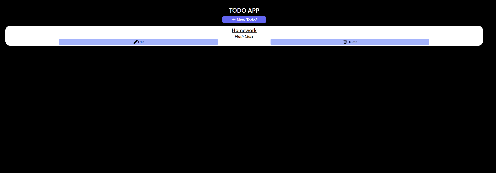

# CRUD Todo App

## Table of contents

- [Overview](#overview)
  - [Screenshot](#screenshot)
  - [Links](#links)
- [My process](#my-process)
  - [Built with](#built-with)
  - [What I learned](#what-i-learned)
  - [Continued development](#continued-development)
  - [Useful resources](#useful-resources)
- [Author](#author)
## Overview
Simple CRUD Todo App
### Screenshot



### Links

- Live Site URL: [Todo-APP](https://howie1329.github.io/react-todo-app/)

## My process
I wanted to focus on a mobile first approch while using React, Tailwind, and Firebase. First was understanding how i wanted the app to look and feel. Next was create components and using tailwind to style. Finally, I used Firebase for the backend for CRUD operations

### Built with

- Semantic HTML5 markup
- [Tailwind](https://tailwindcss.com/) - CSS Framework
- [Firebase](https://firebase.google.com/) - Backend Database
- [React](https://reactjs.org/) - JS library
- Mobile-first workflow
### What I learned

I was able to create a CRUD operation that takes in data from a database, parses through the data for the title and body of the todo, and returns the id for each todo
```JS
  //Read Todos From Database
  async function readTodo(){
    const querySnapshot = await getDocs(collection(db,'todos'));
    let todoData = []
    let dataId = []
    querySnapshot.forEach((doc) => {
      todoData.push(doc.data())
      dataId.push(doc.id)
    })
    setTodo([...todoData])
    setID([...dataId])
  }
```

### Continued development

Next I would like to add a completed status and a time and data display for each todo

### Useful resources

- [Firebase Docs](https://firebase.google.com/docs?authuser=0&hl=en) - This helped me understand how to connect to the Firebase and preform CURD functionaliy
- [Tailwind Docs](https://tailwindcss.com/docs/installation) - Helped me get used to using tailwind. Docs were simple and straight forward

## Author

- GitHub Profile - [Howard Thomas](https://github.com/howie1329)


